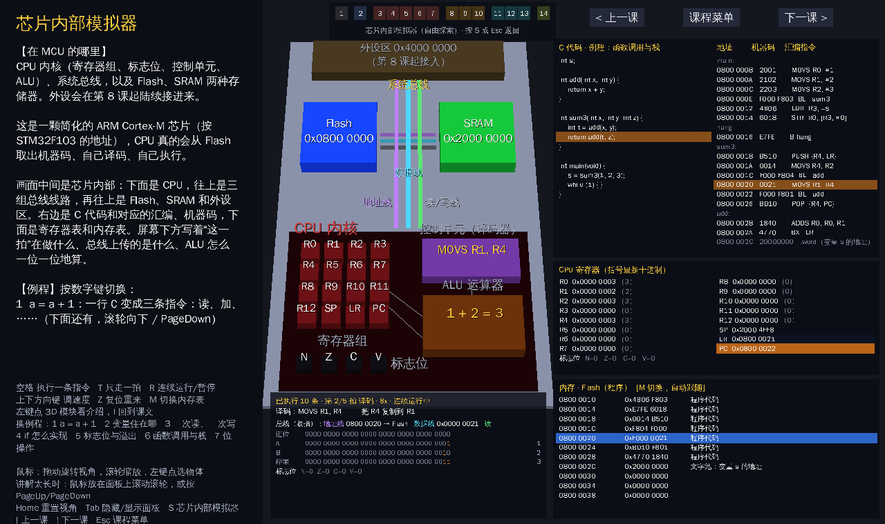

# MCU 3D 入门课堂

零基础学单片机（MCU）：用 [Panda3D](https://www.panda3d.org/) 做的交互式 3D 课程，
把芯片内部“看不见”的东西——寄存器、总线、中断、串口比特——变成可以旋转、点击、动手玩的 3D 场景。

📖 **课程大纲与每课要点**：[docs/课程大纲.md](docs/课程大纲.md)



## 快速开始

### Windows：双击一键启动

双击项目里的 **`Start-MCU3D.bat`** 就行，不需要输入任何东西。它会自动：

1. 找电脑里的 Python 3.8–3.13；没有的话自动静默安装 Python 3.12（只装给当前用户，不需要管理员）
2. 在项目文件夹里建一个独立环境 `.venv`，不影响电脑里的其他 Python
3. 检查并安装 `requirements.txt` 里的依赖（官方源下载失败会自动换清华镜像）
4. 启动课程

第一次运行要下载东西，需要联网，可能要等几分钟；之后再双击会跳过安装，几秒就能打开。
出错时窗口会停住显示原因，按任意键关闭。

### 手动运行（所有系统）

需要 Python 3.8–3.13。

```bash
pip install -r requirements.txt   # 安装 Panda3D
python -m mcu3d                   # 打开课程菜单
python -m mcu3d 5                 # 直接进入第 5 课
```

> 中文显示成方块？见 [assets/fonts/README.md](assets/fonts/README.md)。

## 课程列表

14 课分 5 个阶段，每课开头写“在 MCU 的哪里”和“承上启下”，结尾写“学了能做什么”。
顶部的路线图亮出你现在学到哪一课。

| 阶段 | 课 | 主题 | 你会在 3D 里看到 |
|---|---|---|---|
| 0 全景 | 1 | 什么是 MCU | 揭开芯片外壳，看到里面的 CPU、存储器、外设；LED 闪烁 |
| 1 数据的语言 | 2 | 二进制与寄存器 | 8 个比特方块，按键翻转、计数、移位，实时换算十进制/十六进制 |
| 2 CPU 与存储 | 3 | 存储器与地址 | 模拟器：变量 a、b、c 在 SRAM 的地址，Flash 里的向量表、机器码、文字池 |
| | 4 | 总线：一次读和一次写 | 模拟器：地址包、数据包沿地址线 / 数据线 / 读写线跑，一拍一拍看 |
| | 5 | CPU 内部：取指、译码、执行 | 模拟器：a = a + 1 变成 LDR / ADDS / STR，PC 每次加 2 |
| | 6 | ALU 与标志位 | 模拟器：32 位逐位加法和进位，NZCV，if 变成 CMP + 条件跳转 |
| | 7 | 函数调用与栈 | 模拟器：BL / LR / PUSH / POP，栈在 SRAM 里往下长 |
| 3 控制外部世界 | 8 | GPIO 输入输出 | 写 ODR 点亮 8 个 LED、读按键 IDR，流水灯等程序与对应 C 代码 |
| | 9 | 定时器与 PWM | 计数器柱子、ARR/CCR 比较、更新事件、占空比改变 LED 亮度 |
| | 10 | 时钟与中断 | 时钟波形、PC 指针执行主程序，按键触发中断、栈的压入弹出 |
| 4 通信与感知 | 11 | UART 串口通信 | 拆开 UART 外设：TDR、移位寄存器、波特率发生器、RDR、状态标志 |
| | 12 | I2C 与 SPI | I2C 地址呼叫与应答（含无应答 NACK），SPI 片选与全双工收发 |
| | 13 | ADC 模数转换 | 旋钮电压曲线与 ADC 台阶，切换位数和采样速度 |
| 5 综合项目 | 14 | 温度报警器 | 定时器中断 → ADC → 判断 → LED/蜂鸣器 → 串口发给电脑，完整流程与 C 程序 |

### 芯片内部模拟器

菜单最下面的按钮，或在任何一课按 `S`，都能打开“芯片内部模拟器”（再按 `S` 或 `Esc` 回到那一课）。
它是一颗简化的 ARM Cortex-M 芯片（地址按 STM32F103）：CPU 真的从 Flash 取出 16 位 Thumb 机器码、
自己译码、自己执行。画面里同时有：

- 3D 芯片：寄存器组 R0~R15、标志位 NZCV、控制单元、ALU、地址线 / 数据线 / 读写线、Flash、SRAM
- C 代码、汇编、机器码三栏并排，正在执行的那行高亮
- 寄存器表、内存表（Flash / 变量区 / 栈区）、总线信号、ALU 逐位计算

按键：空格 执行一条指令，`T` 只走一拍，`R` 连续运行，上下方向键调速度，`Z` 复位，`M` 切换内存表，
数字键换例程。外设（GPIO、定时器、中断、UART、ADC）会在后续版本接进模拟器。

## 操作方式

- **鼠标**：左键拖动或右键拖动旋转视角，滚轮缩放，左键单击选中物体；鼠标放在讲解面板上滚动滚轮可以翻看长讲解（也可以按 PageUp/PageDown）
- **键盘**：`[` 上一课，`]` 下一课，`Esc` 课程菜单，`S` 芯片内部模拟器，`Home` 重置视角，`Tab` 隐藏/显示讲解面板
- 每课自己的按键写在左下角提示里（例如空格、数字键）

## 项目结构

```
mcu3d/
  app.py          主程序：窗口、相机、点选、讲解面板、菜单
  ui.py           中文字体加载、3D 文字、中文折行
  glossary.py     术语小词典（“本课新词”的解释）
  shapes.py       程序生成的几何体（方块、圆柱、导线），不依赖模型文件
  parts.py        可复用元件：芯片、LED、按键、波形图、数据包
  theme.py        配色表
  sim/
    asm.py        迷你汇编器：约 20 条 Thumb 指令 → 真实机器码
    machine.py    存储器、总线、CPU（按“拍”返回每条指令的执行过程）
    programs.py   例程：C 代码 + 逐行对应的汇编
    view.py       模拟器画面：3D 芯片 + 2D 数据面板 + 播放控制
  lessons/
    base.py       每课的基类 Lesson
    sim_lesson.py 用模拟器上课的基类 SimLesson，以及自由模拟器
    l01_...py     第 1~14 课
    __init__.py   课程注册表（顺序、阶段）
docs/课程大纲.md  完整大纲、要点、小练习
tests/            离屏冒烟测试
```

### 想改课程 / 加新课？

1. 改讲解文字：直接编辑对应 `lessons/lXX_*.py` 里的中文字符串。
2. 加新课：复制一个现有课程文件，继承 `Lesson`，在 `setup()` 里搭场景、`update(dt)` 里做动画，
   用 `location` / `location_text` 写明这课在 MCU 的哪里，`link_text` 写承上启下，
   `apply_text` 写学了能做什么，用 `terms` 列出要解释的新词，
   然后加到 `lessons/__init__.py` 的 `LESSONS` 和 `STAGES`。
   想用模拟器上课就继承 `SimLesson`，写好 `intro` 和 `programs`；新例程加在 `sim/programs.py`。
3. 改术语解释：编辑 `glossary.py`。
4. 改配色：编辑 `theme.py`。

## 测试

```bash
pip install pytest
python -m pytest tests/                                   # 离屏打开每一课并模拟按键，测试模拟器内核
MCU3D_SHOTS=screenshots python tests/test_smoke.py        # 顺便保存每课截图
```
